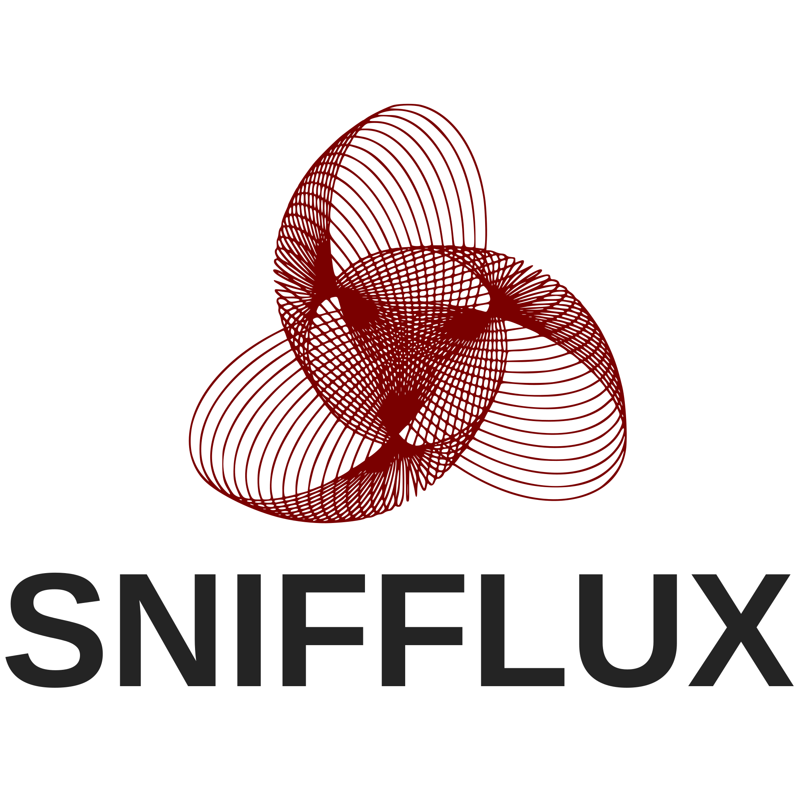

//NETWORK SECURITY MONITORING

# Snifflux

<p align="center">
  
</p>

Real-time network traffic monitoring dashboard built with Flask, Flask-SocketIO, and Scapy.

Snifflux captures packets, classifies traffic, highlights suspicious activity, stores alert history in SQLite, and provides operational actions such as firewall block command generation.

## Features

- Live packet feed (regular, suspicious, safelisted)
- Real-time stats and traffic charts (line + pie)
- Packet filtering and CSV report export
- WHOIS/RDAP lookup for source intelligence
- Alert history analytics (hourly, heatmap, top attackers, country breakdown)
- Optional firewall auto-block flow on Windows
- English/Spanish UI toggle and dark/light theme

## Tech Stack

- **Backend:** Flask, Flask-SocketIO, Scapy, SQLite
- **Frontend:** HTML, CSS, vanilla JavaScript, Chart.js
- **Realtime transport:** WebSocket (Socket.IO)

## Project Structure

```text
sniffy/
├─ app.py
├─ requirements.txt
├─ snifflux_alerts.db
├─ templates/
│  └─ index.html
└─ static/
   └─ img/
      ├─ logo.svg
      └─ snifflux.svg
```

## Requirements

- Python 3.10+ (tested in Windows environments)
- Npcap (or WinPcap) for packet capture on Windows
- Administrator privileges may be needed for:
  - packet capture on some interfaces
  - firewall auto-block operations

## Installation

### 1) Clone or open the project

```bash
cd path/to/sniffy
```

### 2) Create a virtual environment

**Windows (PowerShell):**

```powershell
python -m venv .venv
.\.venv\Scripts\Activate.ps1
```

**macOS/Linux (bash/zsh):**

```bash
python3 -m venv .venv
source .venv/bin/activate
```

### 3) Install dependencies

```bash
python -m pip install --upgrade pip
python -m pip install -r requirements.txt
```

> Note: `eventlet` is installed only for Python `< 3.13`.  
> On Python 3.13+, Snifflux runs with Flask-SocketIO `threading` mode automatically.

## Run

```bash
python app.py
```

Then open:

```text
http://127.0.0.1:5000
```

## Configuration (Environment Variables)

Snifflux supports optional environment-based configuration:

- `SNIFFY_SECRET_KEY`  
  Flask secret key. If not set, Snifflux generates an ephemeral key at startup (recommended to set explicitly in stable deployments).

- `MAX_PACKET_SIZE`  
  Packet size threshold (bytes) used for suspicious detection. Default: `1514`

- `SAFE_IP_CIDRS`  
  Comma-separated CIDRs to safelist. Example:  
  `8.8.8.8/32,8.8.4.4/32,20.0.0.0/8`

- `MICROSOFT_CIDRS`  
  Comma-separated CIDRs for Microsoft-related tagging in analytics.  
  Default: `20.0.0.0/8,40.0.0.0/8,52.0.0.0/8`

- `SNIFFY_CACHE_MAX_ITEMS`  
  Maximum entries for in-memory country/WHOIS caches. Default: `2000`

- `SNIFFY_ALLOWED_ORIGINS`  
  Comma-separated origins allowed for Socket.IO CORS.  
  Default: `http://127.0.0.1:5000,http://localhost:5000`

- `SNIFFY_IFACE`  
  Force packet capture on a specific interface name.

## Main HTTP Endpoints

- `GET /`  
  Main dashboard UI.

- `GET /download-report`  
  Download filtered packets as CSV.

- `GET /api/whois?ip=<ip>`  
  WHOIS/RDAP lookup for an IP.

- `GET /api/panic-command?ip=<ip>`  
  Generate Windows firewall block commands.

- `POST /api/auto-block`  
  Execute firewall rule creation (Windows only).  
  JSON body:

  ```json
  {
    "ip": "203.0.113.15",
    "confirmed": true
  }
  ```

- `GET /api/alert-history?days=7`  
  Alert history and analytics payload.

- `GET /favicon.ico`  
  Favicon compatibility route.

## Detection Logic (High-Level)

Packets are flagged as suspicious when one or more of these conditions is met:

- packet length exceeds `MAX_PACKET_SIZE`
- source or destination port matches sensitive ports (`22`, `23`, `445`, `3389`)

Traffic matching `SAFE_IP_CIDRS` is marked as safelisted and excluded from suspicious alerts.

## Documentation

Detailed technical documentation is available in the `docs` folder:

- `docs/HOW_IT_WORKS.md`: complete end-to-end runtime flow, packet pipeline, Socket.IO event model, analytics model, and failure behavior.

## Database

SQLite file: `snifflux_alerts.db`

Main tables:

- `alert_history`: suspicious traffic records + metadata
- `block_actions`: executed firewall block operations and outputs

## Troubleshooting

### `ModuleNotFoundError: No module named 'flask'`

Your virtual environment is active, but dependencies are not installed:

```bash
python -m pip install -r requirements.txt
```

### No packets captured

- Ensure Npcap is installed on Windows
- Run terminal/IDE as Administrator
- Set a specific interface:

```powershell
$env:SNIFFY_IFACE="Wi-Fi"
python app.py
```

### Auto-block fails

- Works only on Windows
- Requires admin privileges for firewall rule creation
- Check response/output in API result and `block_actions` DB table

## Security Notes

- For production-like usage, set a custom `SNIFFY_SECRET_KEY`
- Keep `SNIFFY_ALLOWED_ORIGINS` restricted to trusted origins (avoid wildcard `*`)
- Firewall auto-block actions should be used with explicit operator confirmation

## License

No license file is currently defined in this repository. Add one if you plan to distribute the project.
